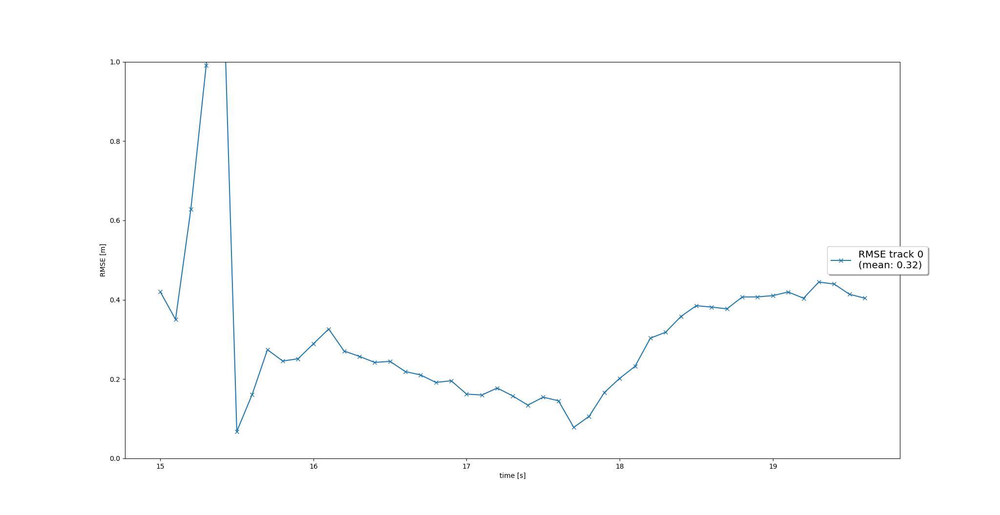
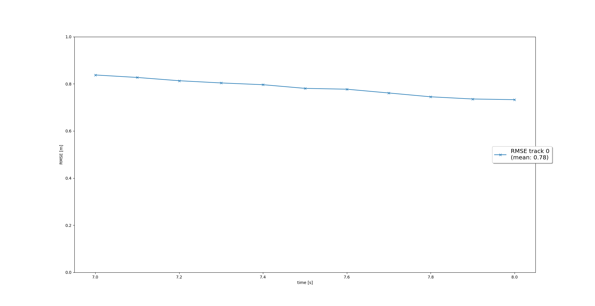
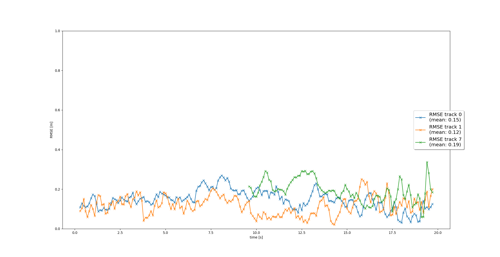
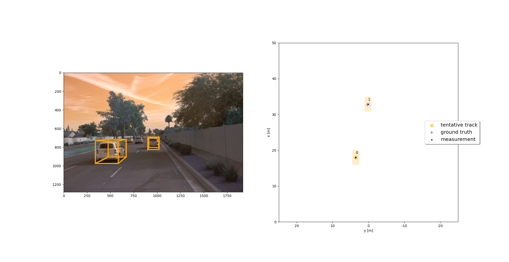
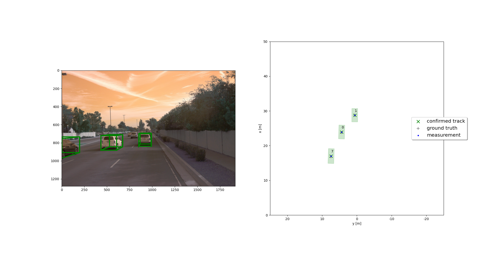
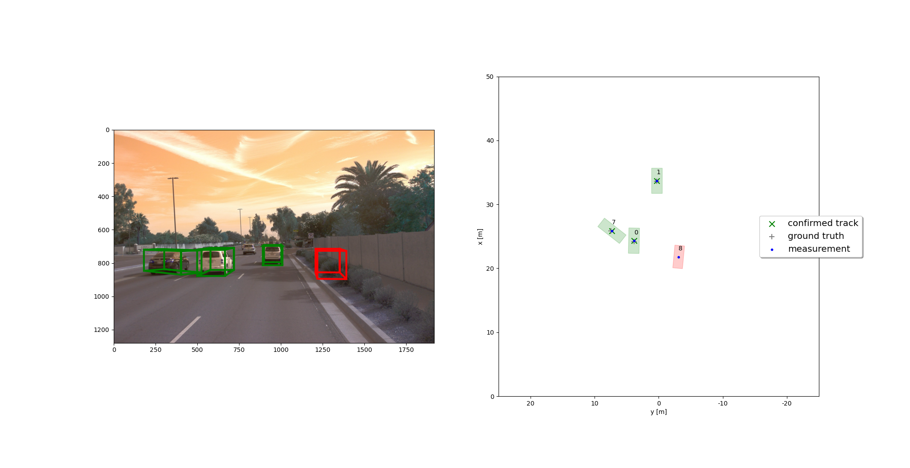
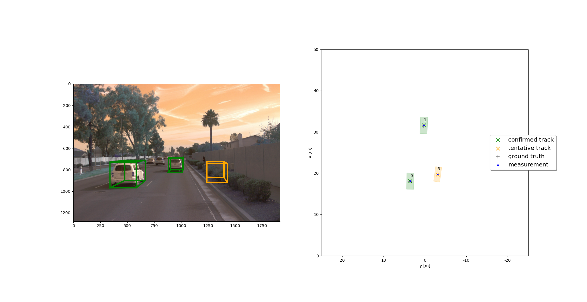
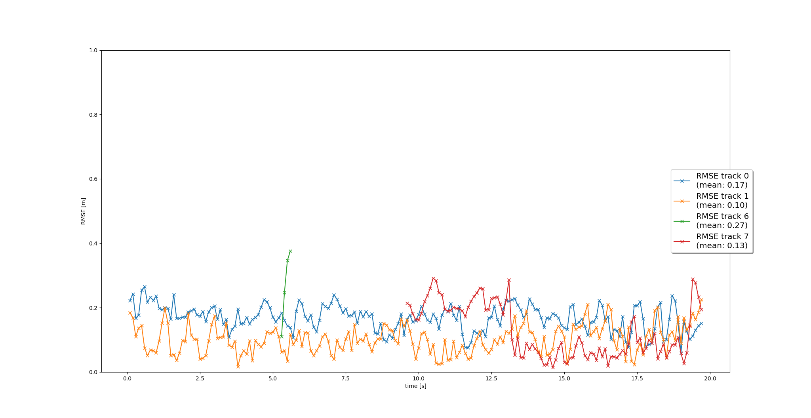

# Final Writeup

## Step 1 - filter.py (kalman filter )
###
This section was to write an kalaman filter for use with the lidar data. This extended the excerises from 2d to 3d. The larges issue was determining the Q value. A post in the mentor help provided the correct matrix. However the matrix was supposed to be provided in the Hints sections of the project. There is a "TODO" there.

The final RMSE was 0.32 which was within the project reqs.

 Figure 1 Final RMSE for part 1.

## Step 2 - trackmanagment.py (track managment)
###
This section was to manage track states from initial creation to death. The first step was to initilize the track detected location and set unknown velocities.

After that the track would be delete if not detected again, moved to tentative state if detected again, or moved to confirmed if detected over a treshold value.
At each step the track can die and get removed if it is no longer tracked. FOr the case of confirmed tracks if its esitamted location grew too large it is removed.

A final RMSE was 0.78.
 Figure 2 Final RMSE for part 2.

## Step 3 - association.py (track /meas association)
###
This section was to associate measurements to tracks. This worked very well.

 Figure 3 Final RMSE for part 3.

 Figure 4 Early tracks before passing confirmed threshold

 Figure 5 Tracks of 3 confirmed positions after one moved in from rear

 Figure 6 Track showing false detection of bush. Has not been moved to tentative

 Figure 7 Track showing false detection of bush. Has been moved to tentative after several detections but never enough to move it to a false confirmed track
 Figure 8 New track has been detected outside camera FOV. It has not been confirmed but is tentative. See Figure 5 for later confirmation

## Step 4 - measurements.py (Adding Camera fusion)

###
This section was to add camera support to augment the lidar. This allows finer tracking and quicker confirmation and removal of tracks.

 Figure 9 Final RMSE for part 4. Note that track 3 was in view but out of range most of the data set for lidar but there was a period it was close enough in the lidar to get picked up and kept being tracked by camera. This was not in the example pictures at end of part 4. THis may be due to different track deletion decisions.

Final project Video

<iframe width="560" height="315" src="https://www.youtube.com/embed/kFlF-6-usT0" title="YouTube video player" frameborder="0" allow="accelerometer; autoplay; clipboard-write; encrypted-media; gyroscope; picture-in-picture" allowfullscreen></iframe>

