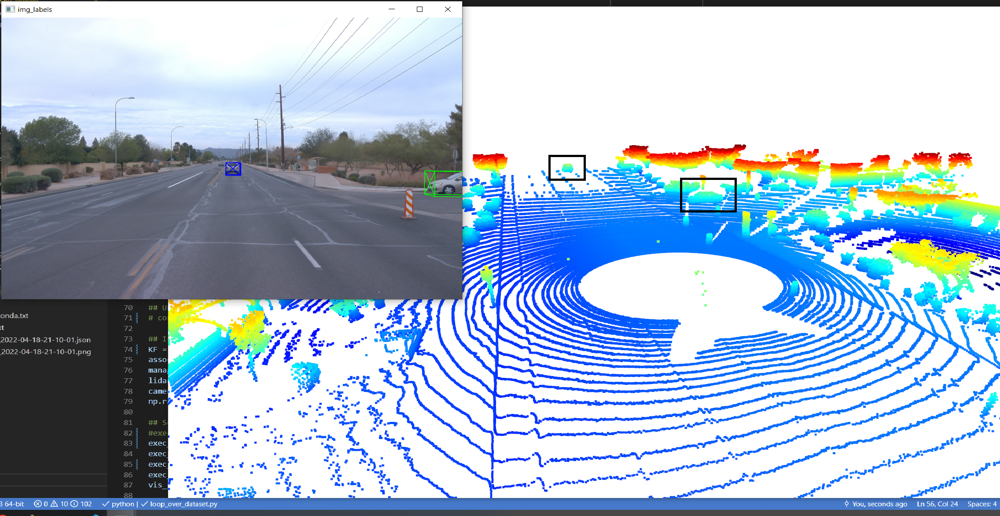
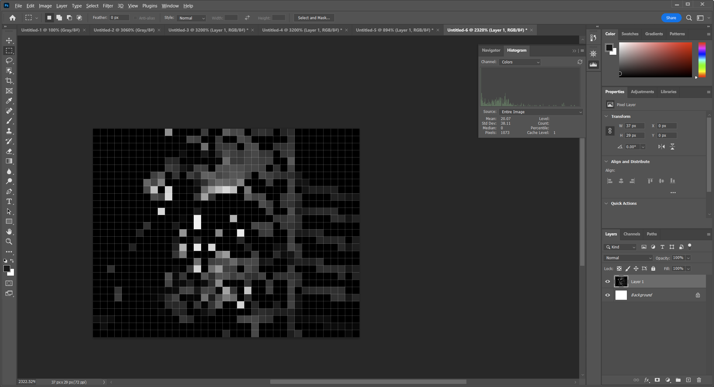

# Final Writeup

## Step 1 - filter.py (kalman filter )
###
This section was to write an kalaman filter for use with the lidar data. This extended the excerises from 2d to 3d. The larges issue was determining the Q value. A post in the mentor help provided the correct matrix. However the matrix was supposed to be provided in the Hints sections of the project. There is a "TODO" there.

The final RMSE was 0.32 which was within the project reqs.

 Figure 1 Final RMSE for part 1.

# TODO revmove below

### ID_S1_EX1
This section extended the exercises of the course to visualize range and intensity data. The purpose of this data was to get a feel for the lidar inputs.

 Figure 1 Final normalization of intensity

 Figure 2 alternative normalization of intensity

Figure 1 and Figure 2 show the Range (top half) and Intensity (bottom half). The two figures are normalizing the intensity differently. Figure 1 provided clearer data so the method presented in the course was used for further steps.

### ID_S1_EX2

This section was to interact with point clouds in a 3d rendered environment. From this view you were able to view, zoom, roate, and move in 3d.

This led into visualizing the data BEV in the following sections

Figure 3 shows the basic view using Open3d. Camera is moved to near the location of the lidar.

A note is that cars lower bumpers have stronger returns. Moving up the the cross bars and the returns drop. Windows do not return lidar well and provide a hole in the range data.

 Figure 4 shows another view of the lidar data in a busier scene.

The four clearly marked cars in front of the lidar have been boxed. They look similar to the figure 3 except they are further away and do not has much detail of their shape.

Figure 5 continues to explore what more complex scenes look like. Not all cars are marked in boxes. However the lines of cars can clearly been seen in much of the image. The view down the cross street as the lidar is approaching makes cross traffic much harder to view. This will be an issue to watch out for in the future.

Figure 6 combines lidar data with a camera and truth. The image continues to show cross traffic is much harder to view and leading traffic. The other part of this image is on flat open asphalt there is very strong returns and the height data looks like it will be very helpful in filtering the "topo" lines around the flat surfaces of the road.

Note: There are more than 10 boxed cars in the above images for the required rubric step.

## Section 2 : Create Birds-Eye View from Lidar PCL
Step 2 of the project is to take the Bird Eye View (BEV) lessons and fully convert a point cloud to to BEV for user. Most of the exercises carried over with slight modifications to fit the midterm.

During the creation of the BEV each channel are displayed and checked for expect results.

Figure 7 shows the Open3d view of the final data along with hand drawn boxes for the vechiles in the scene. As expected the open3d view shows the data on a flat plane as only the heights data points are saved in the BEV for each project.

Figure 8 - intensity

Figure 9 - zoomed intensity histogram (car)

Figure 10 - zoomed intensity histogram (bush)

Figure 11 - Height map view

The above images appear to be in the expected ranges. The histograms may be better viewed by opening the images as 1:1 resolutions.

## Section 3 : Model-based Object Detection in BEV Image
This section was to add a new model, process the data, and display predictions. The model was provided and was pretrained version of resnet 18.

Figure 12 shows the 3d projected bounding boxes along with the bounding boxes from the BEV of one frame. After fixing scaling issues due to using the wrong multipler (width instead of heigh in a location) the bounding boxes being predicted fit well in my expecations for where I'd find vehicles in the images.

## Section 4 : Performance Evaluation for Object Detection

This section was to implement key metrics for determining how well an neral network is processing lidar data.

Figure 13 shows the graphs provided by the visulization tools after processing data into IOUs, recall, and precision.

My final values with an IOU of 0.5 > being kept did not line up quite right with the expected values.
I had a final precision of 94.44 and recall of 92.5. The refrence in the steps had precision = 0.996, recall = 0.8137254901960784 listed. This could be due to my IOU levels not being the same. I could not find a specific value. I also tried 0.7 as refernced in the text but also had differing results.

For a final sanity check the metrics were changed to use the ground truth as the predictions. As expect this made the model "perfect"

Figure 14 - Ground truth as detections

# Summary

At the end of the midterm we have the ability to detect vehicles in lidar images fairly well. We can map the detected vehicles into camera images. Af this point I think I am ready to move into tracking data between frames of the lidar.